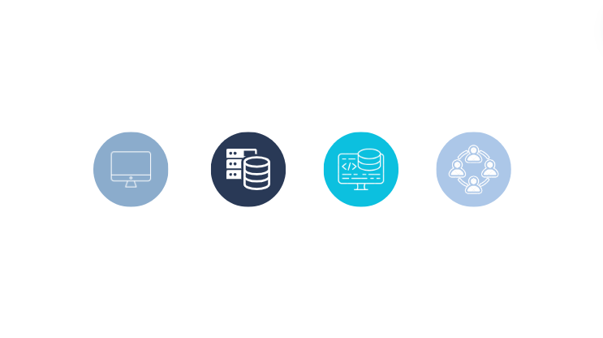

<!-- new slide -->

# Compétences cibles

*figure: Compétences cibles*

<!-- note -->

- **C1 Maquettage** : Maquetter une application mobile.
- **C2 Base de données** : Manipuler une base de données - perfectionnement.
- **C3 Back end** : Développer la partie back-end d’une application web ou web mobile - perfectionnement.
- **C4 Collaboration gestion de projet** : Collaborer à la gestion d’un projet informatique et à l’organisation de l’environnement de développement - perfectionnement.